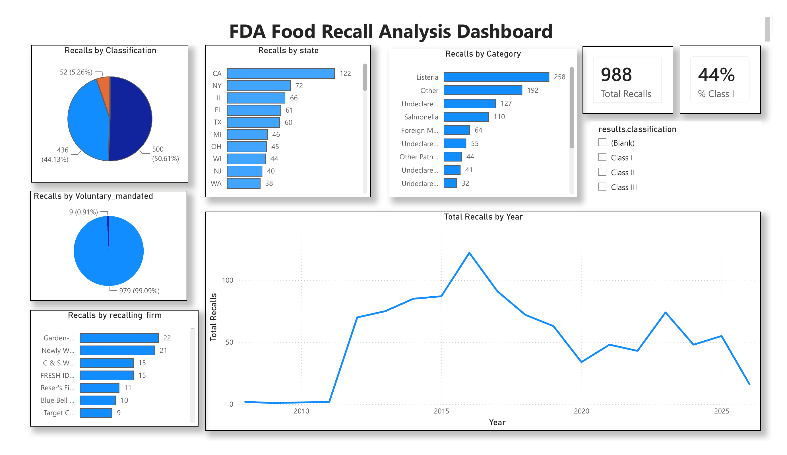

# FDA Food Recall Analysis Dashboard

## Project Overview
Food recalls can signal risk concentration by product category, region, and severity —
useful for consumers, retailers, and regulators trying to understand where food safety
risk is highest. This project analyzes U.S. FDA food recall data to identify patterns in
recall severity, geographic distribution, common causes, and trends over time, presented
as an interactive Power BI dashboard.

## Business Question
Which food product categories, causes, companies, and states are associated with the most
FDA recalls, and what severity patterns exist?

## Target Audience
This dashboard is designed for:
- **Consumers and food safety advocates** wanting to understand which product categories
  and hazards carry the highest recall risk
- **Retailers and grocery buyers** assessing supplier/category risk concentration
- **Public health and regulatory analysts** looking for geographic or seasonal recall
  patterns to inform inspection or outreach priorities

## Dataset Information
Data was pulled directly from the U.S. FDA's official openFDA API — the Food Enforcement
endpoint: https://api.fda.gov/food/enforcement.json

- **Records pulled:** 1,000 (API maximum per call; 29,171 total available historically)
- **Fields used:** status, city, state, country, classification, product_type, event_id,
  recalling_firm, reason_for_recall, recall_initiation_date, report_date,
  termination_date, voluntary_mandated, product_description, distribution_pattern

## Data Cleaning & Exploratory Data Analysis
Full EDA was performed in `fda_recall_eda.ipynb` prior to loading data into Power BI. Key
steps and decisions:

1. **Null check:** Dropped `results.more_code_info` (100% null) and `results.address_2`
   (94.2% null) — both entirely unusable. `termination_date` nulls (4.5%) were kept, since
   these represent legitimately "Ongoing" recalls, not missing data.
2. **Duplicate check:** No true duplicate rows and no duplicate `recall_number` values (the
   actual unique recall identifier). 277 rows shared an `event_id` — investigated and
   confirmed this is expected: a single recall *event* can cover multiple distinct products,
   each with its own unique `recall_number`. **Methodology decision:** this analysis treats
   each row as one product-level recall (1,000 rows = 1,000 product-level recalls,
   representing 723 unique recall events).
3. **International records excluded:** 12 rows were missing `state` — traced to non-U.S.
   companies (Canada, Israel, Chile, Taiwan, Armenia). Since the core research questions
   focus on U.S. state-level patterns, these were excluded, leaving **988 U.S. records**.
4. **Data type fixes:** Date fields were originally stored as malformed integers (e.g.,
   `20160409`) rather than real dates — converted to proper date types so Power BI could
   correctly parse and chart them.
5. **Consistency checks:** Confirmed `product_type` was 100% "Food" (validates the correct
   API endpoint was used) and `classification` contained only the 3 expected values
   (Class I/II/III, no typos or unexpected categories).

**Final cleaned dataset:** 988 U.S. food recall records, ready for analysis.

## Recall Reason Categorization (Methodology Note)
`reason_for_recall` is free text (e.g., *"potential contamination with Listeria
monocytogenes"*), not a pre-categorized field — no structured hazard-type column exists in
this dataset. Reasons were bucketed into categories (Listeria, Salmonella, E. coli,
Undeclared Milk/Egg/Soy/Wheat/Peanut/Fish/Sulfites, Foreign Material, Mislabeling, Other
Pathogen/Contamination, Other) using keyword-based text matching in DAX, applied in
priority order.

**Validation:** categorization was checked against a random 30-row manual review, achieving
~97-100% accuracy after refinement (e.g., adding "butter," "whey," "casein" to the Undeclared
Milk category, which were initially missed).

**Known limitation:** this method assigns a single primary category per recall based on
priority order. Recalls mentioning multiple hazards (e.g., "contains milk and soy, not
declared") are labeled by whichever keyword is checked first — a simplification inherent to
single-label keyword matching on free text.

## DAX Measures & Columns Used
```
Total Recalls = COUNTROWS('enforcement')

Class I Recalls = CALCULATE([Total Recalls], 'enforcement'[results.classification] = "Class I")

% Class I = DIVIDE([Class I Recalls], [Total Recalls])

RecallReasonCategory = SWITCH(TRUE(), ... )   -- keyword-based categorization, see notebook/DAX for full logic
```

## Note on Partial 2026 Data
The trend chart's final data point (2026) reflects a **partial year only** — the dataset
was pulled mid-2026, so this year's total will appear lower than a complete year even if
the underlying recall rate is unchanged. This should not be read as a declining trend; it's
a data cutoff artifact, not a real pattern. (See also: Limitations, below.)

## Dashboard


*(Screenshot to be added — export from Power BI as image/PDF)*

## Key Findings
1. **44.1% of recalls were Class I** (the most severe classification) — nearly half of all
   food recalls in this dataset pose a serious health risk.
2. **Listeria contamination was the single largest identified cause of recalls (26.1%)** —
   more than double the next most common identified cause (Salmonella, 11.1%).
3. **California accounted for the most recalls by state (122, 12.2%)** — nearly double the
   next-highest state (New York, 72).
4. **Recalls are overwhelmingly voluntary (99.1%)** — companies self-report and initiate
   recalls themselves; FDA-mandated recalls are rare.
5. **Recalls rose sharply from 2010 to a peak around 2016**, then declined with some
   year-to-year fluctuation through the most recent data.
6. No single recalling firm dominates recall volume — the top firm accounted for only
   ~2.2% of total recalls, indicating recalls are broadly distributed across many companies
   rather than concentrated in a few repeat offenders.

## Limitations
1. Analysis is based on 1,000 records (API's per-call maximum) out of 29,171 total
   available historically — a substantial sample, but not the complete historical dataset.
2. Recall reason categorization uses single-label keyword matching (see Methodology Note
   above) and may not fully capture recalls with multiple contributing causes.
3. The most recent year (2026) in the trend chart reflects partial-year data only, since
   the year is still in progress — this should not be read as a declining trend.
4. Findings reflect U.S. food recalls only; international recalls were excluded (see Data
   Cleaning).
5. `event_id` duplication means recall *event* counts (723) differ from recall *record*
   counts (988) — all figures in this analysis are at the record (product) level unless
   otherwise stated.

## Learnings & Reflection
This project reinforced that data cleaning decisions — like how to treat duplicate event
IDs or free-text categorization — need to be made deliberately and documented, not just
"fixed" silently. The recall-reason categorization step in particular showed how much
judgment goes into turning unstructured text into usable categories, and why validating
that judgment against a manual sample (rather than trusting it blindly) matters. Working
across both Python (for EDA/cleaning) and Power BI (for the interactive dashboard) also
clarified where each tool is strongest: Python for repeatable, documented data preparation,
and Power BI for fast, interactive exploration once the data is trustworthy.

## How to Reproduce
```bash
pip install pandas jupyter --break-system-packages
```
Run `fda_recall_eda.ipynb` to reproduce the cleaned dataset (`data/data_cleaned.csv`) from
the raw API pull. Import the cleaned CSV into Power BI Desktop (Get Data → Text/CSV) and
apply the DAX measures/columns listed above to reproduce the dashboard.
